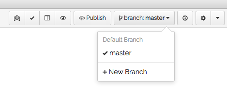
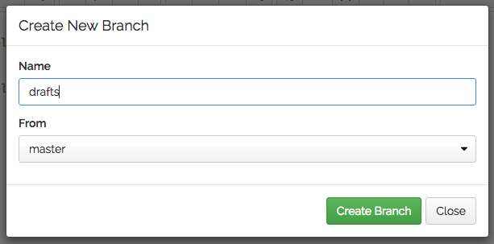
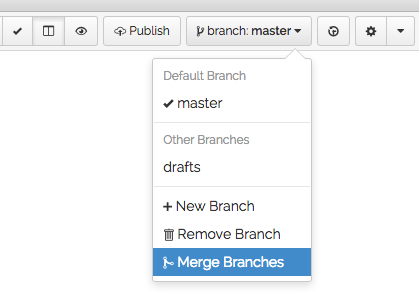
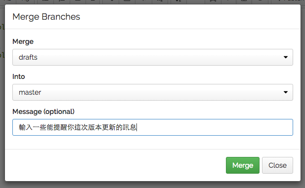
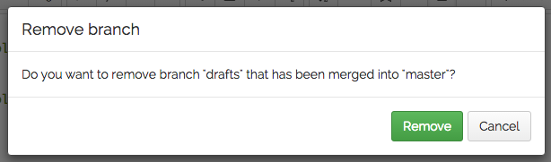

# 不懂 Git 也能善用 GitBook

GitBook 有兩大面向，不妨這樣理解：

1. Book：它是一個能讓你用 Markdown 輕量級標記語法快速製作多種格式電子書的服務。
2. Git：它的底層是一種很強悍的分散式版本管理系統。

如果你沒摸過終端機指令、不知道 Git 是什麼，聽過 GitHub 卻也從來沒用過，你還是可以好好的使用 GitBook，只有一件事情需要注意，後面會說。

### 先明白它的限制

註冊之前，先理解 GitBook 免費帳號是有侷限的：你可以擁有無限制的「開放」書籍專案，但只有「一本」書是私密的（private）。開放的書籍當然可以販售，有很多技術書籍都讓人能夠免費線上閱讀，想下載電子書隨身讀才需要付費。但略懂 Git 的人都可以取得你正在編輯中的原始文件，如果你對這個有顧慮，務必先將專案設定為私密，或是選擇付費。

### 使用編輯界面

然後，你大概就只會透過 GitBook 的編輯器編輯書籍了，請參考 [編輯界面](../editor/README.md) 一章的內容。

打開來是個線上三欄的編輯器：

1. 中間是編輯區域，使用 Markdown 語法。
2. 左欄上方是章節目錄，按右鍵可以新增章節，拖放可以改變順序。
3. 左欄下方是檔案列表，按右鍵可以新增目錄或檔案。裡面必要且最重要的是 `README.md` 與 `SUMMARY.md`。前者是你的書籍簡介，後者是決定書籍目錄真正的依據，例如想要製作多層次的目錄，目前左欄上方是還做不到的，你必須手動編輯 `SUMMARY.md`（但左欄上方會立即呈現結果）。
4. 右欄則是預覽視窗，也可以點擊工具列上的「小眼睛」暫時關閉它。試試看，事實上你可以關閉左欄清單與預覽預覽，像個極簡編輯器一樣專心寫作。

## 最重要的一件事！

先看到畫面右上方的 **branch:master** 按鈕，這表示你正位於「主分支（master branch）」，你可以把它想成「**對外發行版**」的意思。千萬不要立刻就輸入內容、儲存，所謂的「對外發行版」，也就是正式對外的版本，不管是網頁閱讀介面，還是任何一種格式的電子書，一旦你儲存了，GitBook 就立即辛苦的在背後驅動引擎，製作新版的網頁與各種電子書。

使用 GitBook 或 Leanpub，確實都是可以一邊寫書、一邊發佈的模式，但作者或讀者都並不期待，某個新章節輸入或修改了一句、儲存完，就收到通知下載更新，卻看到根本還沒完成的怪異部分，對吧？

比較理想的狀態：你先製作了臨時版的封面、前言，或許還有第一章的內容。繼續撰寫第二章時，不管歷時多久，這些瑣碎的修改與異動都不該讓讀者看到。一直等到寫完第二章、校對過幾次之後，「對外發行版」才正式更新到第二章，讀者收到通知、下載新的版本，開始快樂的閱讀。

所以在剛才畫面中的下拉選單，點擊 **+ New Branch**：

在跳出的窗口中輸入 **drafts**，按下確認，這時原來的按鈕已經變成 **branch:drafts**。好，你可以開始自由使用了。

你進入了一個 **草稿平行世界**，外面的讀者看完了已經發佈的第一章，滿心期待你的更新，而你持續發揮創造力，寫出最好的內容、編輯、校對，第二章終於完成（記得儲存）！是時候來發佈了。

再點擊一下右上方的按鈕，切回 **branch:master**，你完成的第二章不見了！別緊張，記得這是平行世界，請點擊選單下方的 **Merge Branches**：

會跳出一個視窗，輸入一些能提醒你自己的記錄文字：

接著你又收到另一個跳出的確認視窗：

咦！有點懷疑對吧？沒關係，按下 **Remove** 沒錯，檢查一下，你的「對外發行版」、主分支（master branch）已經合併了新的第二章內容。幾分鐘之內，網頁書籍更新，新的電子書被製作出來，所有之前曾購買與下載的讀者，很快就會收到更新訊息了。

這時再點一下右上方的 **branch:master**，變回這樣了：

最前面說過，GitBook 底層是非常強大的分散式版本管理引擎，有很多指令與方法，可以進行各式各樣的複雜操作，但是為了讓不懂 Git 的創作者也能快樂的使用，GitBook 選擇了一個較簡易的模式：**當你的「草稿平行世界」被合併回「對外發行版」之後，就立即摧毀它！**

所以一旦你發行了一個正式的新版本之後，記得立刻開個 **草稿平行世界（新分支）**，繼續後面的創作吧！

### 搭配目錄指引檔使用

當你在目錄清單中按右鍵、新增一個章節時，編輯器會自動將它加入 `SUMMARY.md` 檔案中，也就表示**這個新章節已經被加入製書程序**了！

你可能寫第二章時，想到第三章、第五章的點子；或一開始就先假想後面的章節，全部都建立了出來，但你並不想在發佈第二章時，就預先讓讀者看到後面這些未完成、必定會修改的片段。

記得：**製書程序是根據你的 SUMMARY.md 檔案**，所以只要手動修改一下 `SUMMARY.md` 檔案，你可以擺放各種不會成為實際內容的參考文件，甚至建一個次目錄專擺參考文件、筆記都可以。

## 結論

大致上你只要知道 **「建立草稿分支」**，與 **「修改 SUMMARY.md 檔案」** 這兩個重點，就可以掌握 GitBook 的使用。

不懂 Git 也能善用 GitBook，免費製作各種版本的電子書，輕鬆自在！